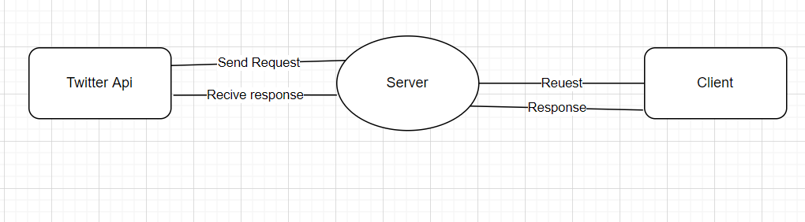

# Shortcutter's Coding Challenge

Streaming Twitter Tweets

Applictioan is geting live data from twitter api and rendring 
that live data to clint.

Langugae:  Nodejs

Frame work: Express
pluggin: Twitter Api, Sockiet.io

Twitter Api Pluggin is help to integrate 
twitter api to get data.

Sockiet.io helps to create a stream between client and server.

In this applicton Server get live data from twitter with twitter api 
twitter api have en end point that we can send query of with type of data 
we need. when we send that query to api we start receivign data from  api.
Client and server are connected with a stream with help of sockets.
When server get data from api then send it to client through socket. Client 
and server are always connectd through sockets thats why we can render live 
data of twitter.

